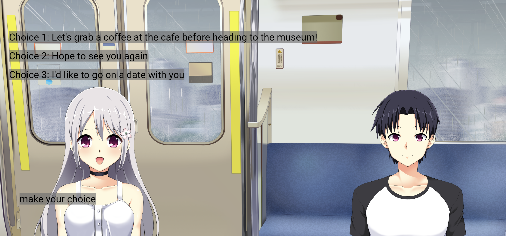

# Jenny Visual Novel


See the live website here: [Github Pages](https://caitlynbakery.github.io/visual_novel_story/)

## Overview

This visual novel is built using the [jenny](https://docs.flame-engine.org/1.6.0/other_modules/jenny/index.html) library from Flame. Jenny is a toolset that adds dialogue into a game in .yarn files. Flame is a Flutter game engine that makes game creation easier. It has powerful functions such as sprites, images, and collision detection.

## Features

### Choices

Using the jenny library, the visual novel displays the text from the .yarn file on the screen. To create a set of choices for the user to select from, the syntax in the .yarn file is to create arrows. After the user selects a choice, the .yarn file jumps to the new text file.

```text
-> Let's grab a coffee at the cafe before heading to the museum!
   Aoi: Oh, I'm getting thirsty. I was just thinking of going!
   Yuto: Cool. How about Mademoiselle Collete?
   Aoi: Ok. Let's go!
   <<jump Cafe>>
-> Hope to see you again
   Aoi: Maybe we'll meet again?
   Yuto: Yeah, maybe.
   <<jump Apartment>>
```

Back in the `project_view_component.dart` file, the code runs the `onChoiceStart` method from the jenny library. Inside the method, it runs a for loop to display the choices and get the user's input.  

```dart
FutureOr<int?> onChoiceStart(DialogueChoice choice) async {}
```



### Facial Expressions

The asset packet from this project uses a series of layers so that facial expressions and clothing can be changed. Using Gimp, I created various versions of my character. In the `project_view_component.dart` file, the sprite is changed in the `onNodeStart` method.

```dart
FutureOr<void> onNodeStart(Node node) {
    switch (node.title) {
      case 'Cafe':
        background.sprite = gameRef.cafeBackgroundSprite;
        girl.sprite = gameRef.girlSmileSprite;
        boy.sprite = gameRef.boySmileSprite;
        break;
        ...
        }}
```

### Completer

Completer is an object that completes Flutter objects at later times. It is used when there are complex async codes and to have control over the `Future`.

In this project, the `Completer` is defined in the `project_view_component.dart` file.

```dart
  Completer<void> _forwardCompleter = Completer();
  Completer<int> _choiceCompleter = Completer<int>();
```

Later, in the `_getChoice` method the `_forwardCompleter` is returned to get the value of the choice the user selected.

```dart
 Future<void> _getChoice(DialogueChoice choice) async {
    return _forwardCompleter.future;
  }
```

## Resources

* [jenny](https://docs.flame-engine.org/1.6.0/other_modules/jenny/index.html)
* [flame](https://docs.flame-engine.org/1.6.0/index.html#)
